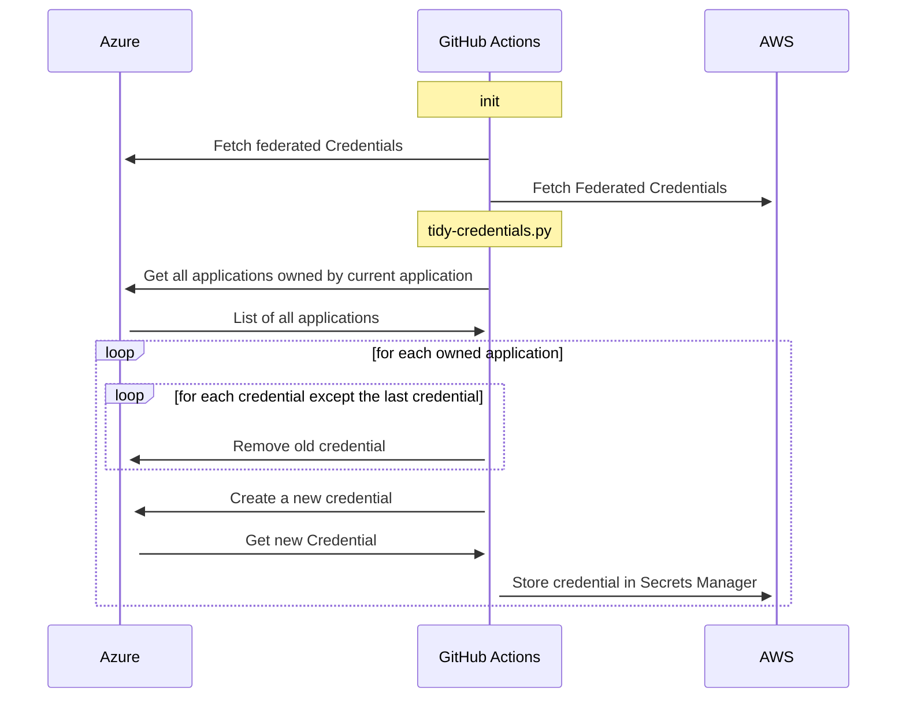

# Rotate Azure service principal configuration in AWS

## Rationale
Azure and AWS both allow access via federated OIDC credentials.  Unfortunately an AWS assumed role entities are unable (without Cognito) to trade its credentials for an OIDC token.  This makes service principals in AWS difficult to authenticate into Azure without having to deal with secrets.  This is a POC to show rotating those credentials.

## Architecture

This is the flow diagram for how it works, executed daily:

## To clone steps
1. Configure local machine to authenticate into Azure and AWS
2. Modify the `github_oidc_subject` variable to match your repo and method of execution
2. Run from inside terraform folder: `terraform init && terraform apply`
3. Admin consent the API permissions for `Application.ReadWrite.OwnedBy` of the parent app registration
3. Update github repo to add the following secrets:
    1. `AWS_ROLE_ARN`
    2. `AWS_REGION`
    3. `AZURE_CLIENT_ID`
    4. `AZURE_TENANT_ID`

## Design considerations
1. No effort has been made on the AWS side to lock down Secrets Manager
2. In Entra, `Application.ReadWrite.OwnedBy` requires admin consent.  This was not automated.
2. Terraform was used to show provisioning OIDC identities on both clouds.
3. Each secret name is just the application id, potentially you could use a tag in the application or do some form of lookup to map an application to a secret name in secrets manager
4. All secrets are written to the same account and region, no consideration for multi-region mapping has been done.  Practically speaking this isn't so important as it is likely if you wanted multi account or region writing you should probably use a different identity to authenticate into Azure for those service principals and run this script multiple times with those.
5. Application will create a secret in secrets manager if it does not exist.